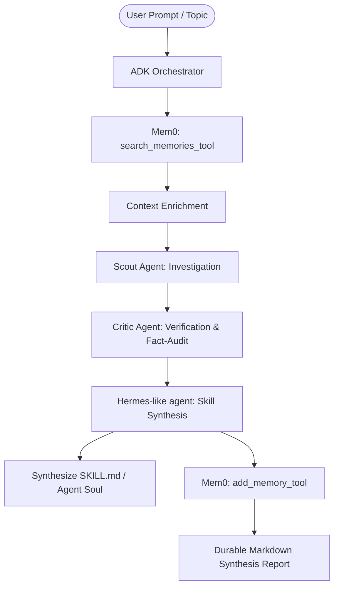

# Self-Improving Research Team

[](https://opensource.org/licenses/Apache-2.0)
[](https://www.typescriptlang.org/)
[](https://react.dev/)
[](https://ai.google.dev/)
[](https://mem0.ai/)

> **▶ [Watch the full demo on Loom](https://www.loom.com/share/e901dc95e9214794a70c9d96944764c8)** — see the ADK multi-agent pipeline, Mem0 MCP memory, AutoSkill synthesis, and token telemetry in action.

An enterprise-grade, multi-agent autonomous research system orchestrated by Google Agent Development Kit (ADK) principles, powered by Google Gemini models, and backed by long-term memory via the **Mem0 Model Context Protocol (MCP)** server. The system features autonomous skill synthesis, real-time token and budget tracking, execution loop guards, and hot-reloadable agent souls.

---

## 📑 Table of Contents
1. [Demo & Screenshots](#-demo--screenshots)
2. [Key Capabilities](#-key-capabilities)
3. [Setup & Quick Start](#-setup--quick-start)
4. [Mem0 MCP Integration](#-mem0-mcp-integration)
5. [Repository Structure](#-repository-structure)
6. [CLI & API Reference](#-cli--api-reference)
7. [License](#-license)

---

## 🎬 Demo & Screenshots

### ▶ Video Demo

> **[Watch the full demo on Loom](https://www.loom.com/share/e901dc95e9214794a70c9d96944764c8)**
>
> See how [@rxShri99](https://github.com/rxShri99) walks us through the whole app start to finish — from submitting a research topic, watching Scout → Critic → Hermes-like Evolver agents run in a loop-guarded ADK pipeline, Mem0 MCP memory being searched and written, AutoSkill synthesis producing `SKILL.md` files, and live token/cost telemetry across all panels.

### Screenshots

Browse the full [screenshot gallery](docs/screenshots/README.md) for all UI surfaces. Key highlights:

| Surface | Preview |
|:---|:---|
| **Research Workflow** — prompt input with quick presets |  |
| **Research Workflow** — agents running |  |
| **Research Workflow** — completed synthesis |  |
| **Mem0 Memory Bank** — after research run |  |
| **AutoSkill Evolution** — synthesised skills |  |
| **Token Telemetry** — live counters |  |
| **CLI Console** |  |

---

<details>
<summary>🏛 Architecture Diagram</summary>

```
                             +-----------------------------------+
                             |     User / Studio Web UI / CLI    |
                             +-----------------+-----------------+
                                               |
                                               v
+-----------------------------------------------------------------------------------------------+
|                                    Express + TypeScript Server                                |
|                                                                                               |
|  +-----------------------------------------------------------------------------------------+  |
|  |                            ADK Research Orchestrator Engine                             |  |
|  |                                                                                         |  |
|  |  +------------------+     +--------------------+     +-------------------------------+  |  |
|  |  |   Run Loop Guard | --> | Token Budget Guard | --> | Live Agent Callbacks & Events |  |  |
|  |  +------------------+     +--------------------+     +-------------------------------+  |  |
|  +-----------------------------------------------------------------------------------------+  |
|             |                            |                             |                      |
|             v                            v                             v                      |
|  +---------------------+    +-------------------------+   +--------------------------------+  |
|  |  Scout Agent        |    |  Critic Agent           |   |  Hermes-like Evolver Agent     |  |
|  |  - Deep Query       |    |  - Hallucination Audits |   |  - Skill Synthesis             |  |
|  |  - Source Synthesis |    |  - Logical Coherence    |   |  - Meta-Evolution (.soul.md)   |  |
|  +---------------------+    +-------------------------+   +--------------------------------+  |
|             |                            |                             |                      |
|             +----------------------------+-----------------------------+                      |
|                                          |                                                    |
|                                          v                                                    |
|  +-----------------------------------------------------------------------------------------+  |
|  |                         Unified Mem0 MCP Client & Store                                 |  |
|  |                                                                                         |  |
|  |  Mode: [ Mocked Local Store <──────── 1-Click Toggle ────────> Real MCP Server ]       |  |
|  |  Endpoint: process.env.MEM0_MCP_URL (http://localhost:8888/mcp)                        |  |
|  |  Transport: HTTP JSON-RPC 2.0 (Auth: none)                                              |  |
|  +-----------------------------------------------------------------------------------------+  |
+-----------------------------------------------------------------------------------------------+
                                           |
                                           v
                       +---------------------------------------+
                       |    Mem0 MCP Server (Local Machine)    |
                       |    9 Tools: add_memory, search, ...   |
                       +---------------------------------------+
```

### Subsystem Flow (Mermaid)



</details>

---

## ⚡ Key Capabilities

- **ADK Multi-Agent Orchestration**: Specialized Scout, Critic, and Hermes-like Evolver agents run in coordinated pipelines with step-level status tracking and loop-guard timeouts.
- **Mem0 MCP Server Integration**:
  - Direct HTTP JSON-RPC 2.0 client communicating with local Mem0 MCP server.
  - Native support for **all 9 Mem0 tools** (`add_memory_tool`, `search_memories_tool`, `get_memory_tool`, `get_all_memories_tool`, `update_memory_tool`, `memory_history_tool`, `delete_memory_tool`, `delete_all_memories_tool`, `reset_memories_tool`).
  - **1-Click Mode Toggle**: Switch seamlessly between **Mocked Store** and **Real MCP Server**.
- **Autonomous Skill Generation (`SKILL.md`)**: Agents detect knowledge gaps and formulate production-ready `SKILL.md` documents on the fly with live dynamic reloading.
- **Live Token & Budget Telemetry**: Real-time tracking of input tokens, output tokens, estimated cost, run durations, and step milestones.
- **Enterprise UI**: Responsive dashboard with Research Hub, Agent Network visualizer, Mem0 Memory Bank, Autonomous Skills matrix, and Developer CLI Console.

---

<details>
<summary>🤖 Agent Hierarchy & Roles</summary>

| Agent | Model | Primary Responsibility |
| :--- | :--- | :--- |
| **Orchestrator** | Gemini 3.7 Flash | Deconstructs user query, manages execution DAG, interacts with Mem0 MCP, compiles final report |
| **Scout** | Gemini 3.7 Flash | Discovers primary domain sources, identifies technical trade-offs, gathers core evidence |
| **Critic** | Gemini 3.7 Flash | Verifies claims, conducts hallucination audits, calculates confidence scores |
| **Hermes-like agent** | Gemini 3.7 Flash | Identifies capability gaps, creates durable skills (`SKILL.md`), updates agent souls (`.soul.md`) |

</details>

---

## 🚀 Setup & Quick Start

The app has **two memory modes** — pick the one that fits your needs before you start:

| | Mock mode (default) | Real MCP mode (advanced) |
|---|---|---|
| **Extra install?** | None | Mem0 MCP server (Docker or pip) |
| **Mem0 API key?** | No | Yes (free at [mem0.ai](https://mem0.ai)) |
| **Memory persists?** | Yes — local `data/mem0_store.json` | Yes — Mem0 cloud |
| **Semantic search?** | Keyword scoring | True vector search |
| **Good for** | Local dev, demos, hackathons | Production / cross-machine memory |

**Most users should follow Path A.** Path B is only needed if you want cloud-backed semantic memory.

---

### Path A — Mock mode (recommended, no Mem0 server needed)

#### Prerequisites
- **Node.js** v22+ (tested on v22.19.0 via `nvm`)
- **Gemini API Key** — get one free at [Google AI Studio](https://aistudio.google.com/)

#### 1. Clone & install
```bash
git clone https://github.com/neomatrix369/self-improving-teams.git
cd self-improving-teams
npm install
```

#### 2. Configure `.env`
```bash
cp .env.example .env
```

Edit `.env` — only one value is required:
```env
# Required
GEMINI_API_KEY="your-gemini-api-key-here"

# Leave these commented out — Mock mode needs neither
# MEM0_MCP_URL="http://localhost:8888/mcp"
# MEM0_API_KEY="m0-..."
```

#### 3. Start the app
```bash
npm run dev
```

Open **http://localhost:3000**. The **Mem0 Memory Bank** tab will show a **"Mocked (Local)"** badge — all memory operations work immediately, backed by `data/mem0_store.json`.

---

<details>
<summary>Path B — Real MCP mode (advanced, optional)</summary>

Only follow this if you want true semantic vector search and persistent memory.  
There are **three sub-options** — pick the one that fits your setup:

| | Option A | Option B | Option C |
|---|---|---|---|
| **Mem0 API key** | Required | Required | **Not needed** |
| **Requires Python** | No | Yes (3.9+) | No |
| **Requires Docker** | Yes | No | Yes |
| **Memory stored** | Mem0 cloud | Mem0 cloud | Local (Qdrant) |
| **Best for** | Cloud + no Python | Cloud + Python | Privacy / offline |

#### 1–2. Clone, install, and configure `.env` (same as Path A)

For **Option A or B** (cloud-backed), add your Mem0 API key:
```env
GEMINI_API_KEY="your-gemini-api-key-here"
MEM0_API_KEY="m0-your-mem0-api-key-here"   # free at https://mem0.ai
MEM0_MCP_URL="http://localhost:8888/mcp"
```

For **Option C** (self-hosted, no API key):
```env
GEMINI_API_KEY="your-gemini-api-key-here"
MEM0_MCP_URL="http://localhost:8000"        # points directly at local Mem0 API
# MEM0_API_KEY not needed
```

#### 3. Start the Mem0 server — choose one option:

---

**Option A — Docker + Mem0 cloud** (no Python required)
```bash
# One-time: clone and build the MCP image
git clone https://github.com/mem0ai/mem0-mcp.git
cd mem0-mcp && docker build -t mem0-mcp-server . && cd ..

# Start (keep this terminal open alongside the app)
docker run --rm -d \
  --name mem0-mcp \
  -e MEM0_API_KEY="m0-your-mem0-api-key-here" \
  -e MEM0_DEFAULT_USER_ID="self-improving-teams" \
  -e HOST="0.0.0.0" \
  -e PORT="8081" \
  -p 8888:8081 \
  mem0-mcp-server

curl -s http://localhost:8888/mcp   # verify: should return a JSON-RPC response
docker stop mem0-mcp                # stop when done
```

---

**Option B — pip / uv + Mem0 cloud** (Python 3.9+)
```bash
pip install mem0-mcp-server          # or: uv pip install mem0-mcp-server

# Start (keep this terminal open alongside the app)
export MEM0_API_KEY="m0-your-mem0-api-key-here"
export MEM0_DEFAULT_USER_ID="self-improving-teams"
export HOST="0.0.0.0"
export PORT="8888"
uvx mem0-mcp-server                  # or: python -m mem0_mcp_server

curl -s http://localhost:8888/mcp   # verify
```

---

**Option C — Self-hosted with Docker Compose** (fully local, no API key)

This starts a local [Qdrant](https://qdrant.tech/) vector database and the Mem0 REST API entirely on your machine — nothing leaves your network.

```bash
# One-time: clone the main mem0 repo
git clone https://github.com/mem0ai/mem0.git
cd mem0

# Start Qdrant (:6333) and the Mem0 API (:8000) together
docker compose up -d

# Verify both are up
curl -s http://localhost:8000/v1/memories/   # Mem0 API
curl -s http://localhost:6333/healthz        # Qdrant
```

> With Option C, `MEM0_MCP_URL` in `.env` should be `http://localhost:8000` (the Mem0 REST API directly) and no `MEM0_API_KEY` is required.

Stop when done:
```bash
docker compose down   # run from inside the mem0/ clone directory
```

---

#### 4. Start the app and switch to Real MCP
```bash
npm run dev
```

Open **http://localhost:3000** → **Mem0 Memory Bank** tab → click **"Real MCP Server"**. The badge shows the active endpoint and latency. The app falls back to Mock mode automatically if the server is unreachable.

</details>

### 4. Build for Production
```bash
npm run build
npm start
```

---

<details>
<summary>🧠 Mem0 MCP Integration</summary>

The application contains a unified Mem0 engine (`server/mem0Store.ts`) that handles both local development and live enterprise MCP endpoints.

### Supported Mem0 MCP Tools
1. `add_memory_tool`: Stores facts, insights, and knowledge graph triples.
2. `search_memories_tool`: Performs semantic search over accumulated research history.
3. `get_memory_tool`: Fetches individual memory nodes.
4. `get_all_memories_tool`: Retrieves all memory records.
5. `update_memory_tool`: Modifies existing memory text or metadata.
6. `memory_history_tool`: Queries evolution history of a memory.
7. `delete_memory_tool`: Deletes single memory entries.
8. `delete_all_memories_tool`: Clears memories for a given namespace.
9. `reset_memories_tool`: Resets storage to cold-start zero state.

### Toggling Between Mock and Real MCP
- **In UI**: Open the **Mem0 Memory Bank** tab and click **"Mocked (Local)"** or **"Real MCP Server"**.
- **In CLI**: Run `memory mode real` or `memory mode mock`.

</details>

---

<details>
<summary>🛠 Repository Structure</summary>

```
.
├── .env.example            # Documented environment variables (MEM0_MCP_URL, GEMINI_API_KEY)
├── LICENSE                 # Apache License 2.0
├── README.md               # Comprehensive documentation and setup instructions
├── metadata.json           # Platform capability declarations
├── package.json            # Node.js dependencies and build scripts
├── server.ts               # Express backend API & Vite SSR middleware
├── server/
│   ├── adkOrchestrator.ts  # Multi-agent ADK execution pipeline & token tracking
│   ├── cliRunner.ts        # Interactive developer terminal commands
│   ├── geminiClient.ts     # Resilient Google GenAI SDK interface with rate limiting
│   ├── mem0Store.ts        # Unified Mem0 MCP Client & Mock Store
│   └── skillManager.ts     # SKILL.md and Hermes-like agent SOUL hot-reloading manager
├── skills/                 # Dynamically generated & system SKILL.md files
├── souls/                  # Agent personality & metacognition profiles
├── src/
│   ├── App.tsx             # Main React application shell
│   ├── components/         # Modular UI components (Dashboard, Mem0Bank, Skills, CLI)
│   ├── types.ts            # Shared TypeScript type definitions
│   └── index.css           # Tailwind CSS styles
└── vite.config.ts          # Vite bundler configuration
```

</details>

---

<details>
<summary>💻 CLI & API Reference</summary>

### CLI Terminal Commands
The built-in CLI Console allows rapid agent orchestration and inspection:
- `research run "<topic>"`: Launch a full autonomous research cycle.
- `memory status`: View Mem0 MCP transport, endpoint, and tool discovery health.
- `memory mode [mock|real]`: Toggle between Mock and Real MCP modes.
- `memory search "<query>"`: Search long-term memory.
- `skills list`: Display status of all active agent skills.
- `skills reset`: Reset skills to cold-start state.

### Key Backend REST Endpoints
- `POST /api/research/start`: Start a new research orchestration run.
- `GET /api/mem0/config`: Get Mem0 MCP connection status and discovered tools.
- `POST /api/mem0/config`: Update Mem0 configuration (`mcpUrl`, `mode`).
- `POST /api/mem0/test-connection`: Ping target MCP server and measure latency.
- `GET /api/mem0/memories`: Query or search stored memories.
- `GET /api/skills`: List all active `SKILL.md` files.

</details>

---

## 📄 License

This project is licensed under the **Apache License 2.0**. See the [LICENSE](LICENSE) file for details.
