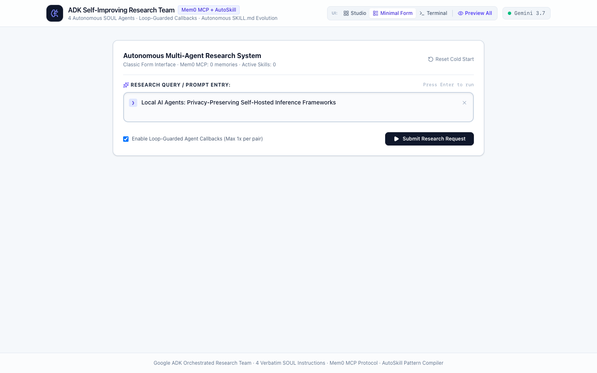
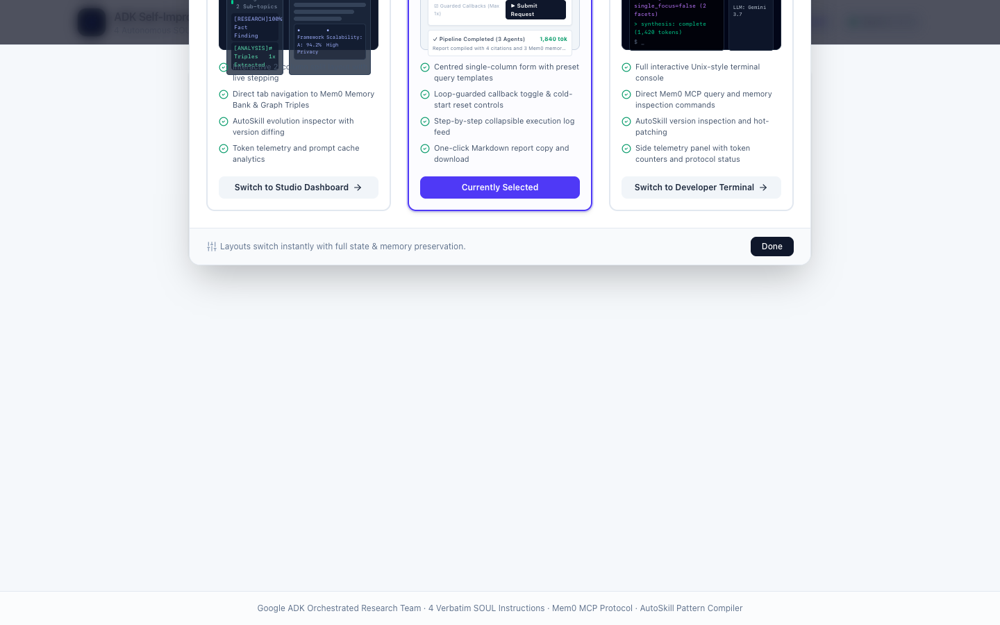
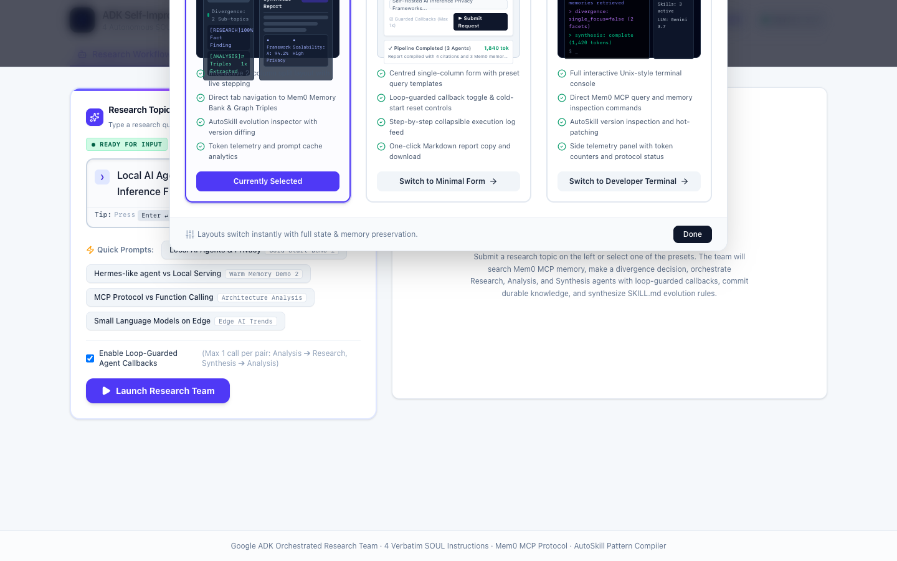
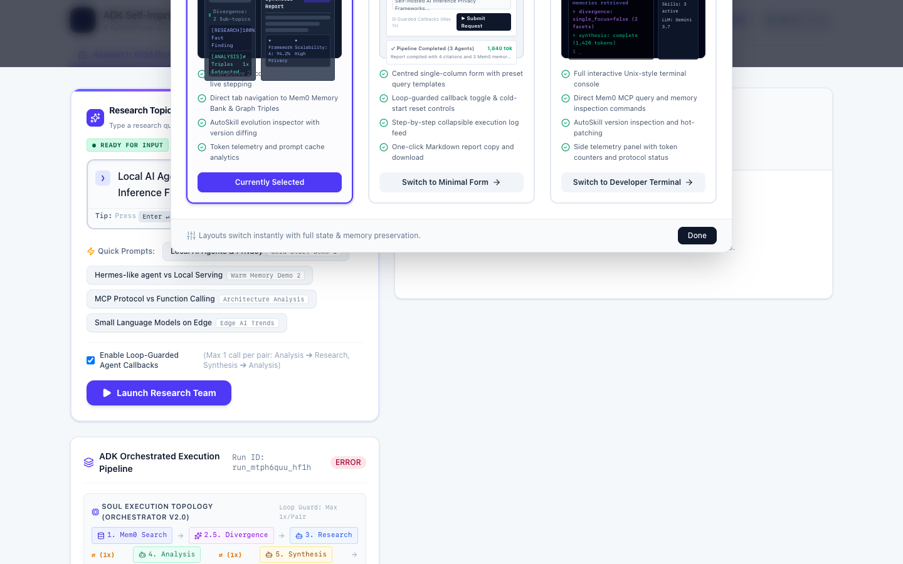
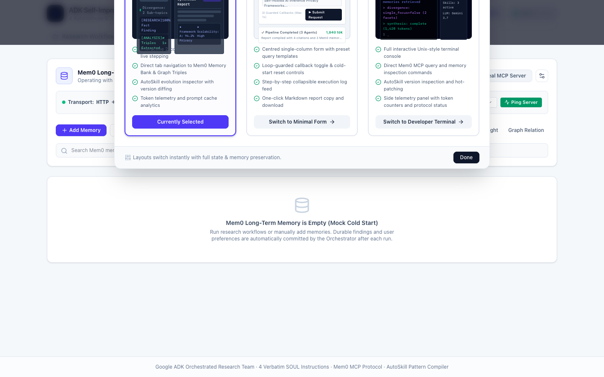
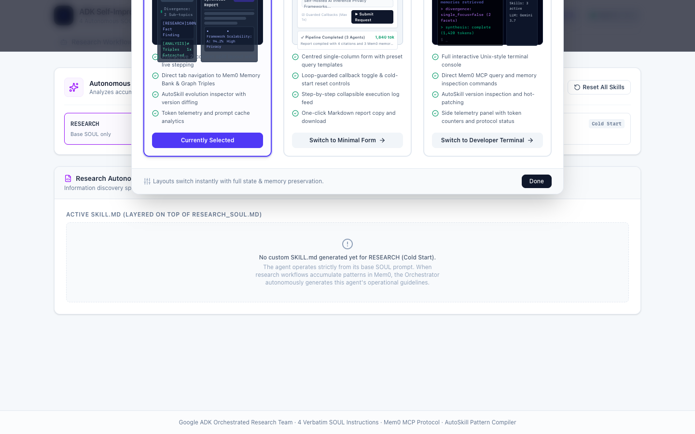
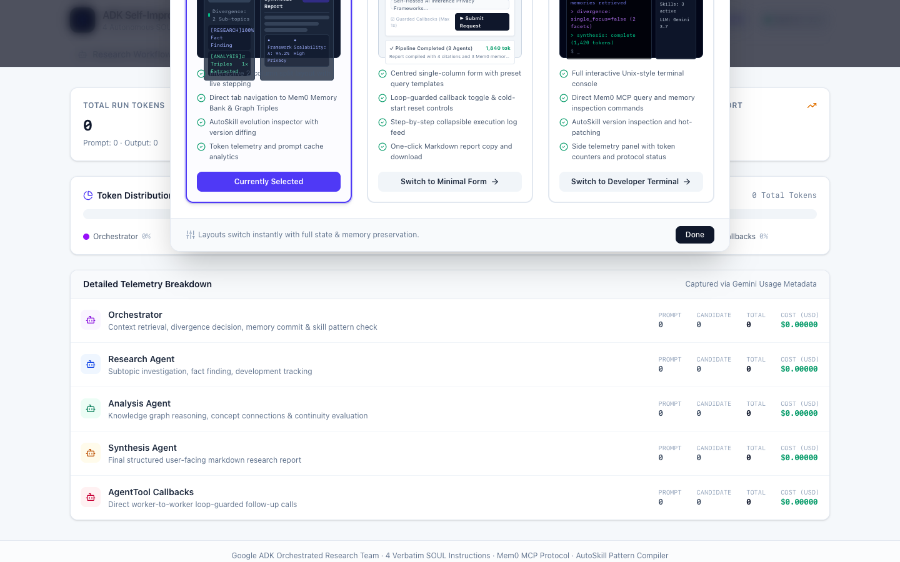
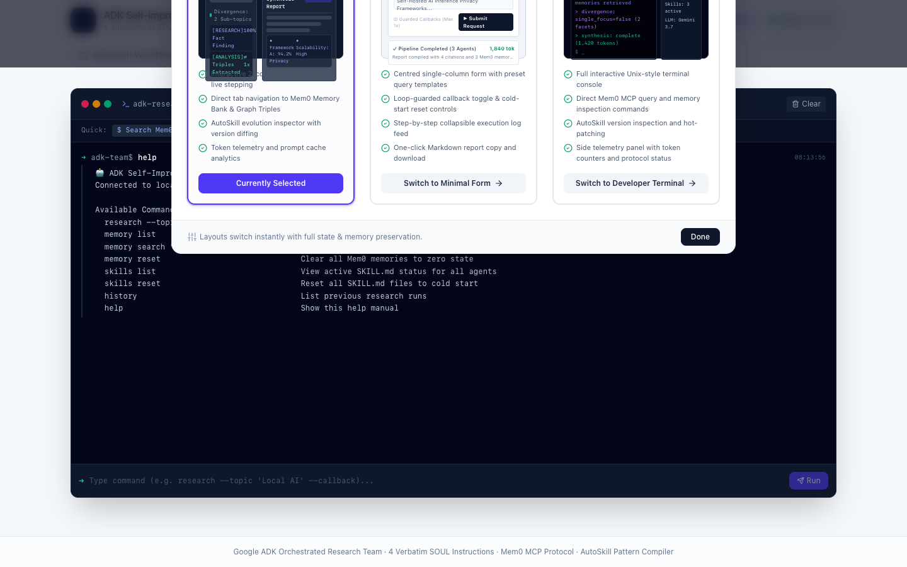
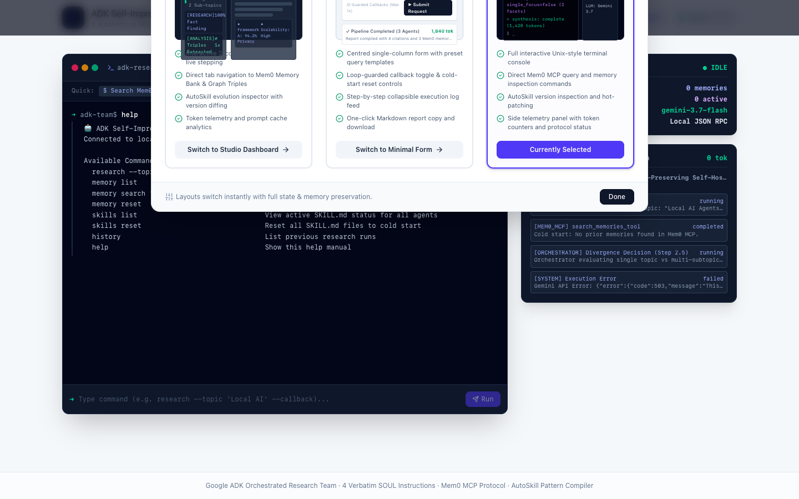

# Self-Improving Research Team — Screenshot Gallery

UI captures grouped by surface, taken from a live development session.

**Demo walkthrough video:** [▶ Watch on Loom](https://www.loom.com/share/e901dc95e9214794a70c9d96944764c8)

Regenerate all screenshots after UI changes:

```bash
# Ensure the dev server is running first
npm run dev &
# Then (requires arm64 Node on Apple Silicon):
~/.nvm/versions/node/v22.19.0/bin/node scripts/capture-screenshots.mjs
```

---

## 1. Dashboard

The Studio, Minimal Form, and Preview All UI variants.

### Studio — ready state

The default Studio view showing the Research Topic & Prompt panel and quick presets.


### Minimal Form view

Compact single-prompt input for rapid research launches.



### Preview All panels

Side-by-side overview of all active panels in one view.



---

## 2. Research Workflow

Multi-agent orchestration lifecycle from prompt to synthesis.

### Prompt input — ready

Research Topic & Prompt with quick preset chips and Loop-Guarded Agent Callbacks toggle.



### Agents running

Scout, Critic, and Hermes-like Evolver agents active with live step callbacks.


### Mid-run progress

Step milestones, token counters, and Mem0 MCP search/store calls in flight.



### Completed synthesis report

Final durable markdown report produced after all three agents complete.


---

## 3. Mem0 Memory Bank

Long-term research memory stored and retrieved via the Mem0 MCP server.

### Empty state

Memory panel before any research run — shows MCP connection status.



### Populated after research

Memories ingested during the research run, searchable by semantic query.


---

## 4. AutoSkill Evolution

Autonomous `SKILL.md` synthesis driven by the Hermes-like Evolver agent.

### Empty state

AutoSkill panel before any research run.


### Populated after research

Skills synthesised by the Evolver agent and hot-reloaded into the live system.



---

## 5. Token Telemetry

Real-time input/output token tracking, estimated cost, and per-step durations.

### Token Telemetry panel



---

## 6. CLI Console

Built-in developer terminal for direct orchestration commands.

### CLI Console



### Terminal view

Full-screen terminal for `research run`, `memory`, and `skills` commands.


